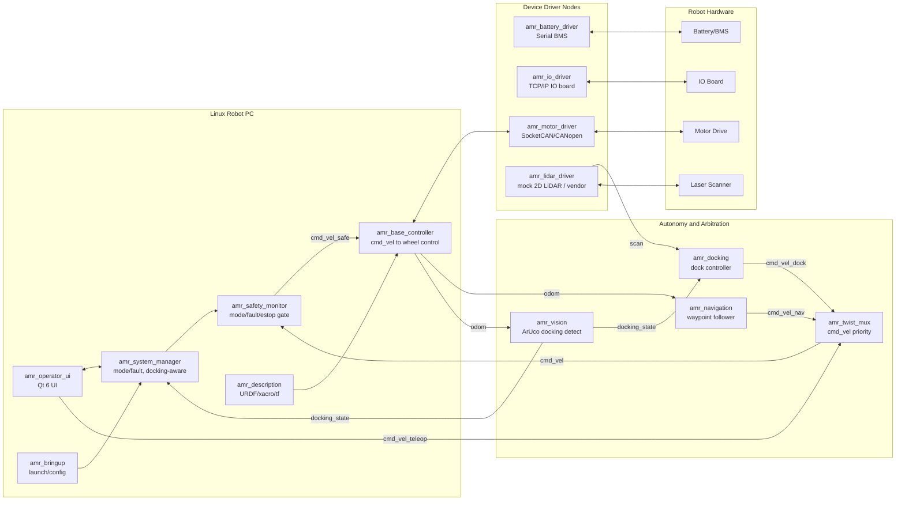

# ROS2_Prac

[](https://github.com/bong7233/ROS2_Prac/actions/workflows/ci.yml)

Linux PC 기반 AGV/AMR 제어 프로그램을 ROS 2 구조로 다시 설계하고 구현하는 포트폴리오 프로젝트입니다.

English documentation: [README.en.md](README.en.md)

이 저장소의 출발점은 레거시 Windows/Delphi 기반 AGV 제어 경험을 ROS 2 방식의 분산 노드, 표준 메시지, lifecycle, diagnostics, Qt UI, 시뮬레이션 가능한 하드웨어 추상화 구조로 옮기는 것입니다. SLAM, Nav2, OpenCV 같은 고급 자율주행 기능은 뒤 단계로 미루고, 먼저 AMR 제어 소프트웨어의 뼈대를 현업 친화적인 방식으로 만드는 것을 목표로 합니다.

기존 AGV/AMR 현장 경험에서 익숙했던 Serial BMS, TCP/IP IO, CAN motor drive, TCP/IP LiDAR 구성을 ROS 2 AMR 아키텍처로 재설계했습니다. 단일 레거시 제어 프로그램 대신 장치 driver node, safety monitor, lifecycle system manager, Qt operator UI, diagnostics, rosbag 기반 디버깅 구조로 분리했고, 향후 ros2_control, Gazebo, Nav2로 확장 가능한 형태로 만들고 있습니다.  


## Project Goal

이 프로젝트는 단순한 ROS 2 튜토리얼 모음이 아니라, 실제 AMR 제어 프로그램에서 필요한 다음 능력을 보여주기 위한 포트폴리오입니다.

- 로봇 PC에서 여러 장치 드라이버를 ROS 2 노드로 분리하고 관리하는 능력
- 배터리, IO 보드, 모터 드라이브, LiDAR 같은 장치와 통신하는 구조 설계 능력
- `cmd_vel`, `odom`, `tf`, `BatteryState`, diagnostics 등 ROS 표준 인터페이스를 이해하고 적용하는 능력
- Qt 기반 운영 UI를 ROS 2 시스템과 안전하게 연결하는 능력
- lifecycle, launch, parameters, rosbag2, diagnostics를 이용해 현장 디버깅 가능한 시스템을 만드는 능력
- 향후 `ros2_control`, Gazebo, Nav2로 확장 가능한 AMR 아키텍처를 설계하는 능력


## Version Policy

2026-06-19 기준으로 새 포트폴리오의 기본 환경은 아래처럼 잡습니다.

| Layer | Choice | Reason |
| --- | --- | --- |
| OS | Ubuntu 24.04 LTS | ROS 2 Jazzy의 Tier 1 Linux 대상이며 산업용 PC/개발 PC 양쪽에서 설명하기 좋습니다. |
| ROS 2 | Jazzy Jalisco LTS | 2024-05-23 출시, 2029-05 EOL인 안정 LTS입니다. Lyrical Luth가 2026-05에 출시되었지만, 이 프로젝트는 검증된 생태계와 자료가 많은 Jazzy를 우선합니다. |
| Language | C++17 중심, Python 보조 | 장치 드라이버, 제어 루프, Qt 연동, FAE 포트폴리오 설명력에 유리합니다. |
| UI | Qt 6 + CMake | Linux PC 기반 운영 UI에 자연스럽고, ROS 2 CMake/ament 흐름과 맞추기 좋습니다. |
| Build | colcon + ament_cmake | ROS 2 표준 패키지/워크스페이스 구조입니다. |
| Control | ros2_control 점진 도입 | 실제 하드웨어와 시뮬레이션을 같은 제어 인터페이스로 연결하기 위한 방향입니다. |
| Simulation | Gazebo Harmonic, mock drivers | 실제 장비 없이도 포트폴리오를 검증할 수 있게 합니다. |
| Navigation | Nav2 후순위 | 현재는 Nav2의 입력 조건인 TF, odom, footprint, sensor topic을 먼저 준비합니다. |

## Scope

### Current Focus

- ROS 2 기본 개념 학습
- AMR 시스템 아키텍처 설계
- 장치별 driver node 책임 분리
- mock hardware 기반 동작 검증
- lifecycle 기반 bringup/shutdown 설계
- diagnostics와 상태 모니터링 설계
- Qt operator UI 구조 설계

### Later Focus

- `ros2_control` hardware interface 구현
- Gazebo 기반 differential drive AMR 시뮬레이션
- `robot_localization`으로 odometry smoothing
- SLAM Toolbox
- Nav2 bringup
- OpenCV, fiducial marker, docking vision (진행 중: `amr_vision`이 ArUco 도킹 마커 인식을 제공. 다음 단계는 도킹 컨트롤러와 sim 카메라 통합)
- 실제 CAN/TCP/Serial 장비 연동

## Target Robot Assumption

초기 설계는 아래와 같은 현장형 AMR 구성을 가정합니다.

| Device | Typical Interface | ROS 2 Responsibility |
| --- | --- | --- |
| Robot PC | Ubuntu 24.04 | ROS 2 graph, Qt UI, launch, logging |
| Battery/BMS | Serial | `sensor_msgs/msg/BatteryState`, battery diagnostics |
| IO board | TCP/IP | digital input/output state, relay command service, safety input monitor |
| Motor drive | CAN or CANopen | wheel command, wheel state, motor fault diagnostics |
| Laser scanner | TCP/IP, vendor driver | `sensor_msgs/msg/LaserScan` or `PointCloud2` |
| Emergency stop | Hardwired + monitored input | hardware stop first, ROS diagnostics second |
| Operator UI | Qt | robot state, manual jog, IO, fault reset, future navigation action client |

## System Architecture



모든 런타임 노드는 `diagnostic_updater`로 `/diagnostics`를 발행하며, `amr_tools health_report`와 UI가 이를 집계해 보여줍니다.

핵심 원칙은 UI, 장치 통신, 제어, 상태 관리, 진단을 한 프로세스에 몰아넣지 않는 것입니다. ROS 2에서는 각 책임을 노드와 패키지로 나누고, 노드 사이 계약을 topic/service/action/parameter로 명확히 둡니다.

## Planned Package Layout

```text
ROS2_Prac/
  README.md
  docs/
    01_ros2_amr_learning_guide.md
    02_amr_system_architecture.md
    03_implementation_roadmap.md
    04_reference_links.md
    05_code_walkthrough.md
    08_gazebo_simulation_guide.md
  src/
    amr_interfaces/
    amr_bringup/
    amr_description/
    amr_sim/
    amr_operator_ui/
    amr_system_manager/
    amr_safety_monitor/
    amr_base_controller/
    amr_battery_driver/
    amr_io_driver/
    amr_motor_driver/
    amr_tools/
    amr_vision/
    amr_docking/
    amr_lidar_driver/
    amr_navigation/
    amr_twist_mux/
    amr_mission/
```

## Current Implementation

현재 코드는 실제 장비 없이 실행 가능한 mock AMR stack입니다.

GitHub Actions CI가 `ubuntu-24.04`에서 정적 검증과 ROS 2 Jazzy `colcon build/test`를 실행합니다.

| Package | Language | Status | Purpose |
| --- | --- | --- | --- |
| `amr_interfaces` | ROS IDL | Implemented | AMR 전용 msg/srv 계약 |
| `amr_battery_driver` | C++ | Implemented | mock BMS, `BatteryState`, diagnostics |
| `amr_io_driver` | C++ | Implemented | mock TCP/IP IO board, `/io_state`, `/set_io` |
| `amr_motor_driver` | C++ | Implemented | mock motor drive, `/wheel_command`, `/motor_state` |
| `amr_safety_monitor` | C++ | Implemented | `/cmd_vel` safety gate, `/cmd_vel_safe`, `/safety_state` |
| `amr_base_controller` | C++ | Implemented | differential drive command conversion, `/odom`, TF |
| `amr_system_manager` | C++ | Implemented | `/robot_state`, `/set_mode`, `/reset_fault` |
| `amr_bringup` | Python launch/YAML | Implemented | `mock_robot.launch.py`와 parameter config |
| `amr_description` | SDF/URDF/RViz | Implemented | Gazebo/RViz용 AMR 모델 |
| `amr_sim` | Gazebo launch/YAML/SDF | Implemented | Gazebo Harmonic world, ROS-Gazebo bridge |
| `amr_operator_ui` | C++/Qt 6 | Implemented | 클릭 가능한 운영 콘솔, 실시간 상태 표시, 수동 조그, 모드/장애 서비스 |
| `amr_tools` | Python | Implemented | FAE용 health report/fault scenario CLI |
| `amr_vision` | Python/OpenCV | Implemented | ArUco 도킹 마커 인식, mock 카메라, `/docking_state` |
| `amr_docking` | Python | Implemented | `/docking_state` 기반 정렬·접근 컨트롤러, `/cmd_vel` 생성 |
| `amr_lidar_driver` | Python | Implemented | mock 2D LiDAR 시뮬레이터, `/scan` (Nav2 입력 준비) |
| `amr_navigation` | Python | Implemented | odom 기반 웨이포인트 추종(pure-pursuit), `/cmd_vel` 생성 |
| `amr_twist_mux` | Python | Implemented | 우선순위 기반 `/cmd_vel` 소스 중재(수동/도킹/주행) |
| `amr_mission` | Python | Implemented | 배터리 인지 미션(순찰→저전압 복귀·충전→재개) |

이번 포트폴리오에서도 Python은 분명히 사용합니다. 다만 역할을 분리합니다.

- C++: 드라이버, 안전 게이트, 베이스 제어, 상태 관리처럼 주기성과 안정성이 중요한 runtime node
- Python: launch file, 현장 점검 CLI, rosbag 분석, integration test, 장비 simulator, 데이터 리포트

FAE 포지션에서는 Python이 매우 중요합니다. 그래서 이 프로젝트에서는 Python을 "로봇을 직접 제어하는 핵심 루프"보다 "현장 문제를 빠르게 확인하고 재현하는 도구"에 배치합니다. 이 방식이 실무적으로도 자연스럽고, C++/Python 둘 다 설명하기 좋습니다.

## ROS 2 Interface Plan

| Interface | Type | Producer | Consumer | Purpose |
| --- | --- | --- | --- | --- |
| `/cmd_vel` | `geometry_msgs/msg/Twist` | UI, Nav2 later | safety/base controller | Robot velocity command |
| `/cmd_vel_safe` | `geometry_msgs/msg/Twist` | safety monitor | base controller | Safety-filtered velocity command |
| `/odom` | `nav_msgs/msg/Odometry` | base controller | RViz, robot_localization, Nav2 later | Local odometry |
| `/tf` | `tf2_msgs/msg/TFMessage` | base controller, robot_state_publisher | all spatial consumers | Frame transform |
| `/battery_state` | `sensor_msgs/msg/BatteryState` | battery driver | UI, diagnostics | Battery telemetry |
| `/scan` | `sensor_msgs/msg/LaserScan` | lidar driver | RViz, Nav2 later | 2D obstacle data |
| `/diagnostics` | `diagnostic_msgs/msg/DiagnosticArray` | all drivers | UI, diagnostic tools | Device health |
| `/robot_state` | custom msg | system manager | UI, logging | Mode/fault summary |
| `/safety_state` | custom msg | safety monitor | UI, system manager | Safety gate state and active reason |
| `/io_state` | custom msg | IO driver | UI, safety monitor | Digital IO status |
| `/motor_state` | custom msg | motor driver | base controller, safety monitor | Motor feedback and fault state |
| `/wheel_command` | custom msg | base controller | motor driver | Wheel velocity command |
| `/set_io` | custom srv | UI/system manager | IO driver | Relay/output control |
| `/set_input` | custom srv | FAE tool/test | IO driver | Mock digital input fault injection |
| `/set_battery_percentage` | custom srv | FAE tool/test | battery driver | Mock low/critical battery injection |
| `/inject_motor_fault` | custom srv | FAE tool/test | motor driver | Mock motor fault injection |
| `/clear_motor_fault` | `std_srvs/srv/Trigger` | FAE tool/UI | motor driver | Motor fault clear |
| `/set_mode` | custom srv | UI | system manager | Operator-selectable mode request |
| `/reset_fault` | `std_srvs/srv/Trigger` | UI/system manager | system manager | Software fault reset request |
| `/docking_state` | custom msg | vision (aruco_docking) | docking controller, UI | ArUco 도킹 마커 거리/횡오차/방위각 |
| `/image`, `/camera_info` | `sensor_msgs` | mock camera or real driver | vision | Docking camera stream |
| `/enable_docking` | `std_srvs/srv/SetBool` | UI/operator | docking controller | 도킹 정렬·접근 시퀀스 시작/정지 |

## Robot Mode Model

처음부터 Nav2의 자동 주행까지 구현하지 않더라도, AMR 제어 프로그램은 상태 모델이 먼저 있어야 합니다.

| Mode | Meaning |
| --- | --- |
| `BOOT` | 프로세스 시작, config 로드 전 |
| `INIT` | 장치 연결, 파라미터 검증, lifecycle configure |
| `MANUAL` | UI jog/manual IO 가능 |
| `AUTO_READY` | 자동 운전 준비 완료, Nav2는 후순위 |
| `AUTO_RUNNING` | 자동 미션 수행 중 |
| `PAUSED` | 일시정지, 안전 정지 유지 |
| `CHARGING` | 충전 또는 도킹 상태 |
| `FAULT` | 복구 가능한 오류 |
| `ESTOP` | 비상정지 입력 감지, 소프트웨어 복구 전 하드웨어 안전 우선 |

## Implementation Milestones

| Milestone | Output |
| --- | --- |
| M0 | README, ROS 2 학습 가이드, AMR 아키텍처 문서 |
| M1 | ROS 2 workspace, 첫 C++ node, launch/config 구조 |
| M2 | `amr_interfaces`와 mock battery/io/motor nodes |
| M3 | `/cmd_vel` 입력, `/odom` 출력, differential drive 계산 |
| M4 | diagnostics, lifecycle, system manager |
| M5 | Qt operator UI와 ROS 2 executor thread 연동 |
| M6 | rosbag2 기반 로그 수집과 재현 |
| M7 | Gazebo mock robot, URDF/xacro, RViz 시각화 |
| M8 | Nav2 준비 조건 검증: TF, odom, footprint, scan |
| M9 | 실제 Serial/TCP/CAN 장비 연동 또는 하드웨어 프로토콜 simulator |

## Quick Start

Ubuntu 24.04 + ROS 2 Jazzy 환경에서 아래 흐름으로 실행합니다.

```bash
source /opt/ros/jazzy/setup.bash
colcon build --symlink-install
source install/setup.bash

ros2 launch amr_bringup mock_robot.launch.py
```

다른 터미널에서 Qt 운영 UI를 실행합니다.

```bash
source /opt/ros/jazzy/setup.bash
source install/setup.bash
ros2 launch amr_operator_ui operator_ui.launch.py
```

왼쪽 작업 공간 화면에서 로봇을 클릭하면 오른쪽에 운영 패널이 열립니다.

다른 터미널에서 mock robot에 manual jog 명령을 줄 수 있습니다.

```bash
source /opt/ros/jazzy/setup.bash
source install/setup.bash

ros2 topic pub --rate 10 /cmd_vel geometry_msgs/msg/Twist \
  "{linear: {x: 0.20}, angular: {z: 0.30}}"
```

상태 확인:

```bash
ros2 node list
ros2 topic list
ros2 topic echo /battery_state
ros2 topic hz /odom
ros2 service list
ros2 topic echo /safety_state
ros2 topic echo /robot_state
ros2 bag record /cmd_vel /cmd_vel_safe /odom /battery_state /diagnostics
```

IO output service:

```bash
ros2 service call /set_io amr_interfaces/srv/SetDigitalOutput \
  "{channel: 2, value: true}"
```

Python FAE health report:

```bash
ros2 run amr_tools health_report --duration 3.0
```

Gazebo 시뮬레이션:

```bash
ros2 launch amr_sim gazebo_amr.launch.py
```

Gazebo는 특정 웹페이지가 아니라 Linux 데스크톱에서 열리는 3D 시뮬레이터 GUI 창입니다. 위 launch를 실행하면 Gazebo 창에 창고 형태의 world와 AMR 모델이 나타나고, 기본값으로 RViz 창도 함께 열립니다.

FAE fault scenario examples:

```bash
ros2 run amr_tools fault_scenario estop-on
ros2 run amr_tools fault_scenario estop-off
ros2 run amr_tools fault_scenario battery-critical
ros2 run amr_tools fault_scenario motor-fault --fault-code 2310
ros2 run amr_tools fault_scenario recover
```

비전 도킹(ArUco 마커 인식):

```bash
ros2 launch amr_vision docking_vision.launch.py
ros2 topic echo /docking_state
ros2 run rqt_image_view rqt_image_view /docking_debug_image
```

mock 카메라가 도킹 마커를 가까이 가져오면 `/docking_state`의 `range_m`이 줄어들고, 정렬되면 `aligned`가 true가 됩니다. 자세한 내용은 [비전 도킹 가이드](docs/10_vision_docking_guide.md)를 참고하세요.

도킹 컨트롤러까지 포함한 폐루프 동작(perception → 정렬·접근 제어 → `/cmd_vel`):

```bash
ros2 launch amr_docking dock_demo.launch.py
ros2 topic echo /cmd_vel
# 컨트롤러를 수동으로 켜고 끄기 (dock_demo는 auto_start로 이미 켜져 있음)
ros2 service call /enable_docking std_srvs/srv/SetBool "{data: true}"
```

생성된 `/cmd_vel`은 manual jog/Nav2와 동일하게 safety monitor를 거칩니다. mock robot이나 Gazebo를 함께 실행하면 실제 base가 움직입니다.

Gazebo 없이 mock 스택만으로 완전한 폐루프 도킹(컨트롤러→safety→base→odom→카메라→검출→컨트롤러):

```bash
ros2 launch amr_docking dock_closed_loop.launch.py
```

로봇이 원점에서 출발해 앞쪽 옆의 마커로 `ALIGN → APPROACH → DOCKED` 순으로 접근합니다.

mock LiDAR로 `/scan` 발행(Gazebo 없이 Nav2 입력 준비):

```bash
ros2 launch amr_lidar_driver mock_lidar.launch.py
ros2 topic echo /scan --once
# 로봇 이동에 따라 스캔이 바뀌게 하려면 mock robot과 함께:
ros2 launch amr_lidar_driver mock_lidar.launch.py use_odom:=true
```

Gazebo 없이 Nav2 입력 3종(TF, odom, scan)을 갖춘 헤드리스 bringup:

```bash
ros2 launch amr_bringup display.launch.py            # +RViz: rviz:=true
ros2 run tf2_tools view_frames                       # odom -> base_link -> lidar_link/camera_link
ros2 topic hz /odom
ros2 topic hz /scan
```

`display.launch.py`는 `mock_robot.launch.py`에 센서 정적 변환(`base_link -> lidar_link`, `base_link -> camera_link`)과 mock LiDAR를 더한 것입니다. base controller가 `odom -> base_link`를 발행하므로 Nav2가 요구하는 TF 체인(`odom -> base_link -> laser`)이 완성됩니다.

웨이포인트 추종(Nav2 없이 odom 기반 자율주행). 로봇이 기본 사각 경로를 돕니다:

```bash
ros2 launch amr_navigation waypoint_demo.launch.py        # 반복: loop:=true
ros2 topic echo /cmd_vel
```

생성된 `/cmd_vel`은 safety monitor를 거치며, `/odom` 피드백으로 폐루프가 닫힙니다. `/enable_navigation`(`std_srvs/SetBool`)로 시작·정지할 수 있습니다.

여러 명령 소스를 동시에 쓸 때는 twist mux로 우선순위 중재(수동 > 도킹 > 주행). 각 컨트롤러를 `cmd_vel_teleop`/`cmd_vel_dock`/`cmd_vel_nav`로 remap하고 mux 출력을 `/cmd_vel`로 둡니다:

```bash
ros2 launch amr_twist_mux twist_mux.launch.py
ros2 run amr_navigation waypoint_follower_node --ros-args -r cmd_vel:=cmd_vel_nav
```

전체 스택을 한 번에(드라이버 + 안전 + 베이스 + 비전 + 도킹 + 주행 + 먹스 중재):

```bash
ros2 launch amr_bringup full_system.launch.py
# 기본: 웨이포인트 추종이 사각 경로를 순찰(cmd_vel_nav). 아래로 우선순위 오버라이드:
ros2 service call /enable_docking std_srvs/srv/SetBool "{data: true}"     # 도킹이 주행보다 우선
ros2 topic pub /cmd_vel_teleop geometry_msgs/msg/Twist "{linear: {x: 0.1}}"  # 수동이 최우선
```

명령 흐름은 `nav/dock/teleop → twist_mux → /cmd_vel → safety_monitor → base_controller → /odom`이고, `/odom`이 비전·주행으로 되돌아가 폐루프가 닫힙니다.

배터리 인지 자율 미션(순찰 → 저전압 시 도킹·충전 → 충전되면 재개). 미션 코디네이터가 주행/도킹을 자동 제어합니다:

```bash
ros2 launch amr_bringup mission_demo.launch.py
ros2 run amr_tools fault_scenario battery-low     # 저전압 → RETURN_TO_DOCK → 도킹 → CHARGING
# 도킹 후 CHARGING 모드에서 mock 배터리가 자동 재충전되어 full이 되면 PATROL로 복귀합니다.
```

`PATROL → RETURN_TO_DOCK → CHARGING → PATROL` 전환은 `/robot_state`와 `/diagnostics`에서 확인할 수 있습니다. 완전 무인 순환을 빠르게 보려면 `discharge_rate_vps`를 키우면 됩니다.

Linux/Windows 개발, 수정, 빌드, 실행 절차는 [빌드와 개발 가이드](docs/06_build_and_development_guide.md)에 정리했습니다.

## Documentation

- [ROS 2 AMR 학습 가이드](docs/01_ros2_amr_learning_guide.md)
- [AMR 시스템 아키텍처](docs/02_amr_system_architecture.md)
- [구현 로드맵](docs/03_implementation_roadmap.md)
- [참고 링크와 버전 근거](docs/04_reference_links.md)
- [코드 구조 설명](docs/05_code_walkthrough.md)
- [빌드와 개발 가이드](docs/06_build_and_development_guide.md)
- [FAE 현장 지원 가이드](docs/07_fae_field_guide.md)
- [Gazebo 시뮬레이션 가이드](docs/08_gazebo_simulation_guide.md)
- [Qt 운영 UI 가이드](docs/09_qt_operator_ui_guide.md)
- [비전 도킹 가이드](docs/10_vision_docking_guide.md)
- [개발환경 설정 가이드 (Windows -> Ubuntu/ROS 2)](docs/11_dev_environment_setup.md)

