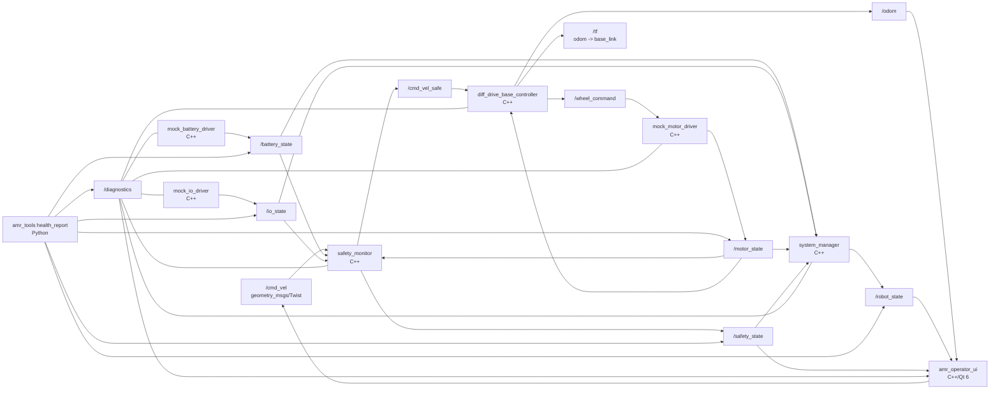

# Code Walkthrough

English version: [Code Walkthrough](en/05_code_walkthrough.en.md)

이 문서는 현재 구현된 mock AMR stack의 코드 구조를 설명합니다. 목표는 ROS 2를 처음 배우는 사람이 코드를 따라 읽으면서 topic, service, parameter, diagnostics, launch, C++/Python 역할 분리를 이해하는 것입니다.


## 1. Current Graph



## 2. Why This Is Split Into Packages

ROS 2 포트폴리오에서 중요한 것은 "노드를 많이 만들었다"가 아니라 "책임을 잘 나눴다"입니다.

| Package | Main File | Key ROS 2 Concepts |
| --- | --- | --- |
| `amr_interfaces` | `msg/*.msg`, `srv/*.srv` | custom interface, 표준 메시지와 custom 메시지의 경계 |
| `amr_battery_driver` | `mock_battery_driver_node.cpp` | publisher, timer, parameter, diagnostics |
| `amr_io_driver` | `mock_io_driver_node.cpp` | publisher, service server, diagnostics |
| `amr_motor_driver` | `mock_motor_driver_node.cpp` | subscriber, publisher, services, command timeout |
| `amr_safety_monitor` | `safety_monitor_node.cpp` | multi-topic subscription, safety gate, watchdog |
| `amr_base_controller` | `diff_drive_base_controller_node.cpp` | kinematics, odometry, TF |
| `amr_system_manager` | `system_manager_node.cpp` | state aggregation, mode service |
| `amr_operator_ui` | `main_window.cpp`, `ros_worker.cpp` | Qt Widgets, ROS executor thread, operator console |
| `amr_bringup` | `mock_robot.launch.py`, `mock_robot.yaml` | launch, parameters |
| `amr_tools` | `health_report.py` | Python/rclpy field-support tooling |

## 3. Message and Service Contracts

`amr_interfaces`는 프로젝트 내부 계약입니다. 외부 ROS 생태계가 이미 아는 데이터는 표준 메시지를 쓰고, AMR 운영 상태처럼 프로젝트 고유 의미가 있는 데이터만 custom으로 정의합니다.

표준 메시지:

- `/cmd_vel`: `geometry_msgs/msg/Twist`
- `/cmd_vel_safe`: `geometry_msgs/msg/Twist`
- `/battery_state`: `sensor_msgs/msg/BatteryState`
- `/odom`: `nav_msgs/msg/Odometry`
- `/diagnostics`: `diagnostic_msgs/msg/DiagnosticArray`

Custom 메시지:

- `/io_state`: `amr_interfaces/msg/IoState`
- `/motor_state`: `amr_interfaces/msg/MotorState`
- `/safety_state`: `amr_interfaces/msg/SafetyState`
- `/robot_state`: `amr_interfaces/msg/RobotState`
- `/wheel_command`: `amr_interfaces/msg/WheelCommand`

Custom 서비스:

- `/set_io`: `amr_interfaces/srv/SetDigitalOutput`
- `/set_input`: `amr_interfaces/srv/SetDigitalInput`
- `/set_battery_percentage`: `amr_interfaces/srv/SetBatteryPercentage`
- `/inject_motor_fault`: `amr_interfaces/srv/InjectMotorFault`
- `/set_mode`: `amr_interfaces/srv/SetMode`
- `/clear_motor_fault`: `std_srvs/srv/Trigger`
- `/reset_fault`: `std_srvs/srv/Trigger`

## 4. Runtime Data Flow

### Manual Command

1. Operator, CLI, or future Qt UI publishes `/cmd_vel`.
2. `safety_monitor` checks estop, protective stop, battery critical, motor fault, communication timeout, command timeout.
3. If safe, `safety_monitor` republishes the command as `/cmd_vel_safe`.
4. If unsafe, it publishes zero velocity and writes the reason to `/safety_state`.
5. `diff_drive_base_controller` converts `/cmd_vel_safe` into `/wheel_command`.
6. `mock_motor_driver` simulates motor response and publishes `/motor_state`.
7. `diff_drive_base_controller` integrates wheel velocity into `/odom` and TF.

### IO Control

1. CLI, future Qt UI, or automation calls `/set_io`.
2. `mock_io_driver` changes the selected output channel.
3. It publishes the updated `/io_state`.
4. `safety_monitor` and `system_manager` consume `/io_state`.

### Diagnostics

Each C++ node uses `diagnostic_updater`. This is intentional because FAE work needs quick fault isolation:

- Is the driver alive?
- Is communication OK?
- Is command timeout active?
- Is the motor enabled?
- Is battery low or critical?
- Which node reports the worst diagnostic level?

`amr_tools health_report` subscribes to `/diagnostics` and summarizes that information from Python.

### FAE Fault Injection

`amr_tools fault_scenario`는 mock driver의 service를 호출해서 현장 장애를 재현합니다.

```text
fault_scenario estop-on
  -> /set_input channel 0 true
  -> mock_io_driver
  -> /io_state
  -> safety_monitor
  -> /safety_state command_allowed=false
  -> system_manager
  -> /robot_state ESTOP
```

```text
fault_scenario motor-fault
  -> /inject_motor_fault
  -> mock_motor_driver
  -> /motor_state fault_active=true
  -> safety_monitor
  -> /cmd_vel_safe zero
  -> /diagnostics ERROR
```

## 5. C++ Style Notes

The C++ nodes intentionally follow patterns that scale to real hardware.

- Parameters are declared in the constructor and validated immediately.
- Topic and service names are relative names so launch namespaces can be added later.
- `diagnostic_updater` is used in every runtime node.
- Command timeout exists in both `safety_monitor` and `mock_motor_driver`.
- The base controller calculates odometry from motor state, not from requested command alone.
- Hardware-specific protocol logic is not mixed into UI or system manager code.

When real hardware is added later, the mock node should not be edited into a giant mixed node. Instead, keep the ROS interface stable and replace the transport/protocol side:

```text
ROS node
  -> protocol adapter
  -> transport
  -> hardware
```

Examples:

- BMS: ROS node -> BMS frame parser -> serial transport
- IO board: ROS node -> Modbus/custom protocol -> TCP transport
- Motor drive: ROS node -> CAN/CANopen protocol -> SocketCAN transport

## 6. Python Role In This Portfolio

Python is not a backup language here. It has a clear professional role.

Good Python use cases in this project:

- launch files
- health report CLI
- fault scenario CLI
- rosbag2 analysis scripts
- protocol simulators
- integration tests
- field log parsing
- factory/service automation
- quick device bringup checks

Good C++ use cases in this project:

- motor control
- safety gate
- hardware driver nodes
- odometry
- Qt UI integration with ROS 2
- high-rate or latency-sensitive logic

This split is useful for an FAE portfolio because it shows both real-time-ish runtime discipline and field automation skill.

## 7. Qt Operator UI Structure

`amr_operator_ui`는 Gazebo 화면 안에 들어가는 플러그인이 아니라, 실제 로봇과 Gazebo 시뮬레이션 모두에 붙을 수 있는 별도 ROS 2 Qt 노드입니다.

```text
Qt MainWindow
  -> RobotSceneWidget: 상단 시점 로봇 위치 표시와 클릭 선택
  -> side panel: mode, safety, battery, IO, motor, diagnostics 표시

RosWorker
  -> subscribe: /odom, /battery_state, /io_state, /motor_state, /safety_state, /robot_state, /diagnostics
  -> publish: /cmd_vel
  -> service call: /set_mode, /reset_fault
```

ROS callback은 `rclcpp::executors::MultiThreadedExecutor` 스레드에서 받고, Qt 화면 갱신은 signal/slot으로 메인 스레드에 전달합니다. 이 구조는 현업 Qt+ROS 운영 프로그램에서 thread 충돌을 줄이는 기본 패턴입니다.

## 8. How To Read The Code

Recommended reading order:

1. `src/amr_interfaces/msg/RobotState.msg`
2. `src/amr_interfaces/msg/IoState.msg`
3. `src/amr_interfaces/msg/MotorState.msg`
4. `src/amr_bringup/config/mock_robot.yaml`
5. `src/amr_bringup/launch/mock_robot.launch.py`
6. `src/amr_battery_driver/src/mock_battery_driver_node.cpp`
7. `src/amr_io_driver/src/mock_io_driver_node.cpp`
8. `src/amr_motor_driver/src/mock_motor_driver_node.cpp`
9. `src/amr_safety_monitor/src/safety_monitor_node.cpp`
10. `src/amr_base_controller/src/diff_drive_base_controller_node.cpp`
11. `src/amr_system_manager/src/system_manager_node.cpp`
12. `src/amr_operator_ui/src/ros_worker.cpp`
13. `src/amr_operator_ui/src/main_window.cpp`
14. `src/amr_operator_ui/src/robot_scene_widget.cpp`
15. `src/amr_tools/amr_tools/health_report.py`

## 9. Expected Demo Commands

Build:

```bash
source /opt/ros/jazzy/setup.bash
colcon build --symlink-install
source install/setup.bash
```

Run stack:

```bash
ros2 launch amr_bringup mock_robot.launch.py
```

Command robot:

```bash
ros2 topic pub --rate 10 /cmd_vel geometry_msgs/msg/Twist \
  "{linear: {x: 0.20}, angular: {z: 0.30}}"
```

Inspect:

```bash
ros2 topic echo /robot_state
ros2 topic echo /safety_state
ros2 topic hz /odom
ros2 run tf2_ros tf2_echo odom base_link
ros2 run amr_tools health_report --duration 3.0
```

IO service:

```bash
ros2 service call /set_io amr_interfaces/srv/SetDigitalOutput \
  "{channel: 2, value: true}"
```

Mode service:

```bash
ros2 service call /set_mode amr_interfaces/srv/SetMode "{mode: 2}"
```
