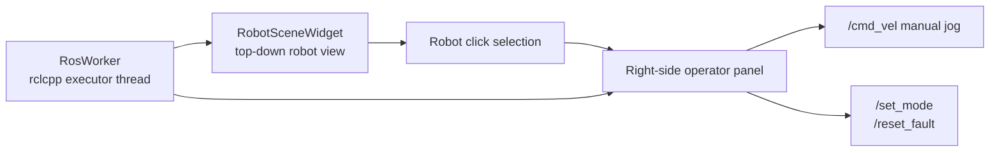
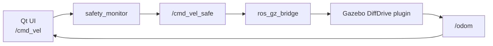

# Qt 운영 UI 가이드

English version: [Qt Operator UI Guide](en/09_qt_operator_ui_guide.en.md)

`amr_operator_ui`는 ROS2_Prac AMR stack을 위한 Qt 6 기반 운영 콘솔입니다. Gazebo 안에 들어가는 화면이 아니라, 실제 로봇 PC나 Gazebo 시뮬레이션과 같은 ROS 2 graph에 붙는 별도 데스크톱 GUI입니다.

## 1. UI 목표

이 UI는 포트폴리오에서 다음 역량을 보여주기 위해 만들었습니다.

- ROS 2 topic/service를 Qt 프로그램과 안전하게 연동하는 능력
- 로봇 상태, 배터리, IO, 모터, 안전 게이트, diagnostics를 한 화면에서 보는 운영자 관점
- `/cmd_vel` 수동 조그, `/set_mode`, `/reset_fault` 같은 현장 조작 흐름
- Gazebo 시뮬레이션과 실제 로봇 모두에 재사용 가능한 ROS graph 중심 UI 구조

## 2. 화면 구성

왼쪽은 top-down workspace입니다. `/odom`을 기준으로 로봇 위치와 heading을 그립니다. 로봇을 클릭하면 오른쪽 운영 패널이 열립니다.

오른쪽 패널은 다음 정보를 보여줍니다.

- Robot: mode, state message, odom
- Safety: command gate, fault, estop, communication 상태
- Power: battery percentage, voltage, current
- Devices: motor state, IO input/output state
- Diagnostics: ROS diagnostics worst level과 요약
- Manual Jog: Forward, Back, Left, Right, Stop
- Service buttons: Set Manual, Reset Fault



## 3. ROS 인터페이스

UI가 구독하는 topic:

| Topic | Type | UI 사용 목적 |
| --- | --- | --- |
| `/odom` | `nav_msgs/msg/Odometry` | workspace의 로봇 위치와 heading |
| `/battery_state` | `sensor_msgs/msg/BatteryState` | battery percentage, voltage, current |
| `/io_state` | `amr_interfaces/msg/IoState` | estop, protective stop, DI/DO 상태 |
| `/motor_state` | `amr_interfaces/msg/MotorState` | motor enable, fault, wheel velocity |
| `/safety_state` | `amr_interfaces/msg/SafetyState` | command gate 허용 여부와 차단 이유 |
| `/robot_state` | `amr_interfaces/msg/RobotState` | mode, fault summary, operator message |
| `/diagnostics` | `diagnostic_msgs/msg/DiagnosticArray` | 장치별 health summary |

UI가 publish/call 하는 인터페이스:

| Interface | Type | 목적 |
| --- | --- | --- |
| `/cmd_vel` | `geometry_msgs/msg/Twist` | 수동 조그 명령 |
| `/set_mode` | `amr_interfaces/srv/SetMode` | MANUAL mode 요청 |
| `/reset_fault` | `std_srvs/srv/Trigger` | system manager software fault reset |

## 4. 코드 구조

```text
src/amr_operator_ui/
  CMakeLists.txt
  package.xml
  launch/operator_ui.launch.py
  include/amr_operator_ui/
    robot_state_cache.hpp
    ros_worker.hpp
    robot_scene_widget.hpp
    main_window.hpp
  src/
    main.cpp
    ros_worker.cpp
    robot_scene_widget.cpp
    main_window.cpp
```

핵심 분리는 다음과 같습니다.

- `RosWorker`: `rclcpp::executors::MultiThreadedExecutor`를 별도 스레드에서 실행하고 ROS topic/service를 처리합니다.
- `RobotUiState`: ROS 메시지를 Qt가 표시하기 쉬운 상태 snapshot으로 모읍니다.
- `RobotSceneWidget`: `/odom` 기반 top-down 로봇 위치, heading, path trail을 그립니다.
- `MainWindow`: 오른쪽 운영 패널, 수동 조그 버튼, mode/fault service 버튼을 관리합니다.

ROS callback에서 Qt widget을 직접 만지지 않고 signal/slot으로 상태를 전달합니다. 이 방식은 Qt main thread와 ROS executor thread를 분리해서 GUI freeze와 thread race를 줄입니다.

## 5. Mock Stack에서 실행

터미널 1:

```bash
source /opt/ros/jazzy/setup.bash
cd ~/ros2_ws/ROS2_Prac
source install/setup.bash
ros2 launch amr_bringup mock_robot.launch.py
```

터미널 2:

```bash
source /opt/ros/jazzy/setup.bash
cd ~/ros2_ws/ROS2_Prac
source install/setup.bash
ros2 launch amr_operator_ui operator_ui.launch.py
```

UI가 뜨면 왼쪽 workspace의 로봇을 클릭합니다. 오른쪽 패널에서 상태를 보고 수동 조그 버튼을 누르면 `/cmd_vel`이 publish됩니다.

## 6. Gazebo와 함께 실행

Gazebo는 웹 페이지가 아니라 Linux desktop에서 열리는 3D simulator GUI입니다. Qt UI는 Gazebo 창 안에 붙는 것이 아니라, Gazebo와 같은 ROS 2 graph에 연결되는 별도 창입니다.

터미널 1:

```bash
source /opt/ros/jazzy/setup.bash
cd ~/ros2_ws/ROS2_Prac
source install/setup.bash
ros2 launch amr_sim gazebo_amr.launch.py
```

터미널 2:

```bash
source /opt/ros/jazzy/setup.bash
cd ~/ros2_ws/ROS2_Prac
source install/setup.bash
ros2 launch amr_operator_ui operator_ui.launch.py
```

명령 흐름:



즉, Qt UI의 조그 버튼으로 명령을 보내면 `safety_monitor`가 안전 조건을 확인하고, 통과한 명령만 Gazebo AMR 모델로 들어갑니다. Gazebo가 다시 `/odom`을 publish하므로 Qt UI의 workspace에서도 로봇 위치가 움직입니다.

## 7. 확장 아이디어

FAE 포트폴리오 관점에서 다음 기능을 추가하면 더 강해집니다.

- namespace 기반 다중 로봇 선택: `/robot_1/odom`, `/robot_2/odom`
- IO 상세 패널: output relay ON/OFF, input edge history
- Nav2 action client: goal pose 지정, cancel, feedback 표시
- rosbag record 버튼: 장애 발생 전후 topic 자동 저장
- diagnostics drill-down: node별 key/value table
- device page 구조: BMS, IO, motor drive별 상세 페이지

