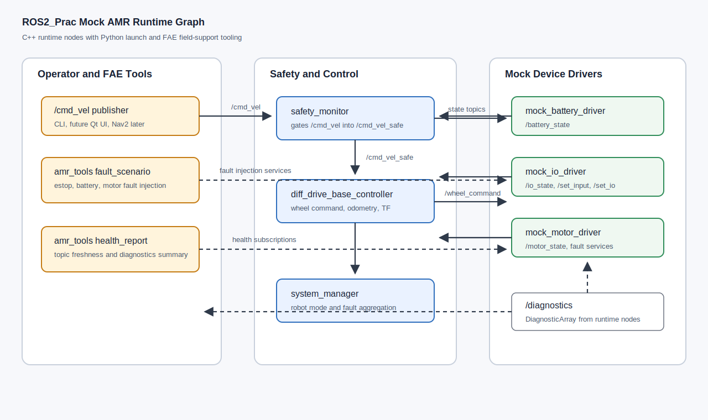

# Code Walkthrough

Korean version: [05_code_walkthrough.md](../05_code_walkthrough.md)



This document explains the current mock AMR runtime stack.

## 1. Main Data Flow

```text
/cmd_vel
  -> safety_monitor
  -> /cmd_vel_safe
  -> diff_drive_base_controller
  -> /wheel_command
  -> mock_motor_driver
  -> /motor_state
  -> diff_drive_base_controller
  -> /odom and /tf
```

## 2. Package Reading Order

1. `amr_interfaces`
2. `amr_bringup/config/mock_robot.yaml`
3. `amr_bringup/launch/mock_robot.launch.py`
4. `amr_battery_driver`
5. `amr_io_driver`
6. `amr_motor_driver`
7. `amr_safety_monitor`
8. `amr_base_controller`
9. `amr_system_manager`
10. `amr_tools`

## 3. Important Interfaces

| Interface | Type | Purpose |
| --- | --- | --- |
| `/cmd_vel` | `geometry_msgs/msg/Twist` | Raw motion command |
| `/cmd_vel_safe` | `geometry_msgs/msg/Twist` | Safety-filtered command |
| `/wheel_command` | custom msg | Wheel velocity command |
| `/motor_state` | custom msg | Motor feedback and faults |
| `/odom` | `nav_msgs/msg/Odometry` | Local odometry |
| `/safety_state` | custom msg | Safety gate reason |
| `/robot_state` | custom msg | Mode/fault summary |
| `/diagnostics` | `DiagnosticArray` | Health data |

## 4. FAE Services

| Service | Purpose |
| --- | --- |
| `/set_input` | Force mock IO input |
| `/set_battery_percentage` | Force low or critical battery |
| `/inject_motor_fault` | Inject motor drive fault |
| `/clear_motor_fault` | Clear motor drive fault |
| `/reset_fault` | Reset software fault state |

## 5. Why C++ and Python Are Both Used

C++ handles runtime behavior:

- drivers
- safety gate
- odometry
- robot state

Python handles FAE support:

- launch files
- health report CLI
- fault scenario CLI
- future rosbag/log analysis

