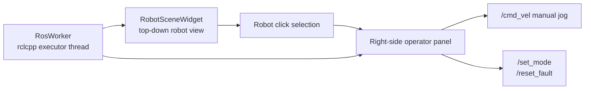
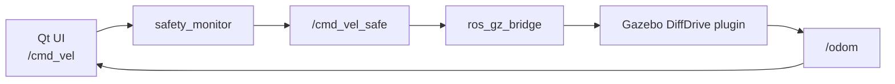

# Qt Operator UI Guide

Korean version: [09_qt_operator_ui_guide.md](../09_qt_operator_ui_guide.md)

`amr_operator_ui` is a Qt 6 operator console for the ROS2_Prac AMR stack. It is not embedded inside Gazebo. It is a separate desktop GUI that connects to the same ROS 2 graph as either the real robot or the Gazebo simulation.

## 1. UI Goals

This UI is designed to show the following portfolio skills:

- Connecting ROS 2 topics and services to a Qt application safely
- Presenting robot state, battery, IO, motor, safety gate, and diagnostics from an operator perspective
- Supporting field-style operations such as `/cmd_vel` manual jog, `/set_mode`, and `/reset_fault`
- Keeping the UI reusable for both a Gazebo simulation and a real robot because it depends on the ROS graph, not simulator internals

## 2. Screen Layout

The left side is a top-down workspace. It draws the robot pose and heading from `/odom`. Clicking the robot opens the right-side operator panel.

The right panel shows:

- Robot: mode, state message, odom
- Safety: command gate, fault, estop, communication state
- Power: battery percentage, voltage, current
- Devices: motor state and IO input/output state
- Diagnostics: worst ROS diagnostics level and summary
- Manual Jog: Forward, Back, Left, Right, Stop
- Service buttons: Set Manual, Reset Fault



## 3. ROS Interfaces

Subscribed topics:

| Topic | Type | UI purpose |
| --- | --- | --- |
| `/odom` | `nav_msgs/msg/Odometry` | Robot position and heading in the workspace |
| `/battery_state` | `sensor_msgs/msg/BatteryState` | Battery percentage, voltage, current |
| `/io_state` | `amr_interfaces/msg/IoState` | Estop, protective stop, DI/DO state |
| `/motor_state` | `amr_interfaces/msg/MotorState` | Motor enable, fault, wheel velocity |
| `/safety_state` | `amr_interfaces/msg/SafetyState` | Command gate state and blocked reason |
| `/robot_state` | `amr_interfaces/msg/RobotState` | Mode, fault summary, operator message |
| `/diagnostics` | `diagnostic_msgs/msg/DiagnosticArray` | Device health summary |

Published/called interfaces:

| Interface | Type | Purpose |
| --- | --- | --- |
| `/cmd_vel` | `geometry_msgs/msg/Twist` | Manual jog command |
| `/set_mode` | `amr_interfaces/srv/SetMode` | Request MANUAL mode |
| `/reset_fault` | `std_srvs/srv/Trigger` | Request system manager software fault reset |

## 4. Code Structure

```text
src/amr_operator_ui/
  CMakeLists.txt
  package.xml
  launch/operator_ui.launch.py
  include/amr_operator_ui/
    robot_state_cache.hpp
    ros_worker.hpp
    robot_scene_widget.hpp
    main_window.hpp
  src/
    main.cpp
    ros_worker.cpp
    robot_scene_widget.cpp
    main_window.cpp
```

The key responsibilities are:

- `RosWorker`: runs a `rclcpp::executors::MultiThreadedExecutor` in a background thread and handles ROS topics/services.
- `RobotUiState`: collects ROS messages into a display-friendly Qt state snapshot.
- `RobotSceneWidget`: draws the top-down robot pose, heading, and path trail from `/odom`.
- `MainWindow`: manages the right-side operator panel, manual jog buttons, and mode/fault service buttons.

ROS callbacks do not directly touch Qt widgets. They emit a state snapshot through Qt signals, and the widgets update on the Qt main thread. This keeps the GUI responsive and reduces thread-race risk.

## 5. Run With The Mock Stack

Terminal 1:

```bash
source /opt/ros/jazzy/setup.bash
cd ~/ros2_ws/ROS2_Prac
source install/setup.bash
ros2 launch amr_bringup mock_robot.launch.py
```

Terminal 2:

```bash
source /opt/ros/jazzy/setup.bash
cd ~/ros2_ws/ROS2_Prac
source install/setup.bash
ros2 launch amr_operator_ui operator_ui.launch.py
```

When the UI opens, click the robot in the left workspace. The right panel opens, and the manual jog buttons publish `/cmd_vel`.

## 6. Run With Gazebo

Gazebo is not a web page. It is a 3D simulator GUI that opens on the Linux desktop. The Qt UI is not part of the Gazebo window; it is a separate GUI connected to the same ROS 2 graph.

Terminal 1:

```bash
source /opt/ros/jazzy/setup.bash
cd ~/ros2_ws/ROS2_Prac
source install/setup.bash
ros2 launch amr_sim gazebo_amr.launch.py
```

Terminal 2:

```bash
source /opt/ros/jazzy/setup.bash
cd ~/ros2_ws/ROS2_Prac
source install/setup.bash
ros2 launch amr_operator_ui operator_ui.launch.py
```

Command flow:



The Qt jog buttons publish `/cmd_vel`. `safety_monitor` checks the safety conditions and only forwards safe commands as `/cmd_vel_safe`. `ros_gz_bridge` sends that command to the Gazebo AMR model. Gazebo publishes `/odom`, and the Qt workspace view updates from that odometry.

## 7. Extension Ideas

Useful next steps for an FAE portfolio:

- Namespace-based multi-robot selection: `/robot_1/odom`, `/robot_2/odom`
- IO detail panel: output relay ON/OFF and input edge history
- Nav2 action client: goal pose, cancel, feedback display
- rosbag record button: automatic topic capture around a fault
- Diagnostics drill-down: per-node key/value table
- Device pages: detailed pages for BMS, IO board, and motor drive

